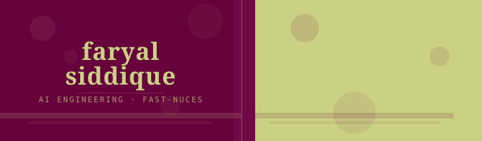

**AI Engineering · Agentic Systems · LLM Pipelines · ML Systems Research**

BSc AI Engineering at FAST-NUCES Islamabad (2023–present) · AI Intern @ AI GenMat · Top 10 Finalist, QS ImpACT Skills Challenge 2026

📍 Islamabad, Pakistan &nbsp;·&nbsp; 📬 faryalnet34@gmail.com

---

## Research & Results

| | |

|---|---|

| Validation accuracy on WISDM-18 HAR benchmark | **95.53%** &nbsp;(+10.85% over SETransformer baseline) |

| Speedup on GPU-optimised clinical NLP inference pipeline | **60x** &nbsp;(full ROUGE quality preservation) |

| QS ImpACT Skills Challenge 2026 | **Top 10 Finalist** |

---

## Featured Projects

**TakTalk — Deafblind Multimodal Communication System**

`LangGraph` `LangChain` `LLaMA-3` `ChromaDB` `FastAPI` `Docker` `WebSockets`

Multimodal pipeline translating Lorm touch-grid inputs into natural language and back to haptic vibration responses. LangGraph-orchestrated multi-agent workflow with async tool orchestration, RAG-grounded Lorm translation retrieval, and real-time WebSocket streaming.

---

**Autonomous Dataset Auditor**

`Python` `Scikit-learn` `Streamlit` `Pandas`

Agentic auditing framework with five specialised detectors (leakage, contamination, class bias, spurious correlations, feature utility), contingency planning, critic-based confidence evaluation, and self-correcting adaptive rechecks.

---

**ClinicSum Pipeline**

`PyTorch` `HuggingFace` `CUDA` `FP16` `Pipeline Parallelism`

GPU-optimised clinical note summarisation achieving **60x speedup** over sequential baseline. BART-base with FP16 mixed precision and producer-consumer pipeline architecture, with full ROUGE quality preservation.

---

**Neural HAR Transformer**

`PyTorch` `Transformers` `Time-Series Modeling`

Novel temporal deformation Transformer achieving **95.53% validation accuracy** on the WISDM-18 benchmark, +10.85% over SETransformer baseline. Submitted to IBCAST 2026.

---

## Tech Stack

| Domain | Tools |

|---|---|

| LLM & Agents | LangGraph · LangChain · LlamaIndex · OpenAI API · Ollama · MCP |

| ML / AI | PyTorch · TensorFlow · Transformers · CNNs · LSTMs · XGBoost |

| RAG & Vector DB | ChromaDB · FAISS · Sentence-Transformers · BM25 · Dense Retrieval |

| Systems | CUDA · FP16 Mixed Precision · Pipeline Parallelism · GPU Inference Optimisation |

| Backend | FastAPI · Flask · Docker · SQLite · MongoDB · Async Python · WebSockets |

| Languages | Python · C/C++ · C# · Assembly |

---

## Connect

